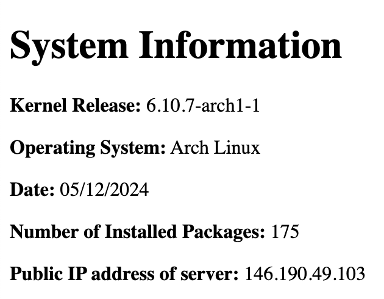
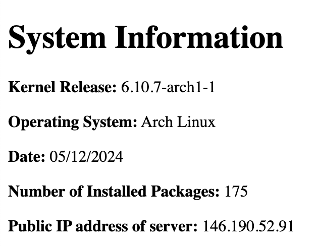

# Setting Up a Load Balancer on DigitalOcean

This guide explains how to set up two Nginx web servers and configure a load balancer on DigitalOcean.

---

## Table of Contents
- [Setting Up a Load Balancer on DigitalOcean](#setting-up-a-load-balancer-on-digitalocean)
  - [Table of Contents](#table-of-contents)
  - [How to create the Nginx Web Servers](#how-to-create-the-nginx-web-servers)
    - [Important Note:](#important-note)
    - [Steps:](#steps)
  - [How to create the Load Balancer](#how-to-create-the-load-balancer)
  - [Congratulations!](#congratulations)

---

## How to create the Nginx Web Servers

### Important Note:
When creating the droplets, assign them identical tags (e.g., `web`). These tags will be used later to configure the load balancer.

### Steps:
1. **Create Two Identical Droplets:**
   - Log in to your [DigitalOcean account](https://cloud.digitalocean.com/).
   - Set up two Arch Linux droplets in the same data center region.
   - Assign both droplets the same tag (`web`).

2. **Update the System:**
   - SSH into each droplet and update its Arch Linux system:
     ```bash
     sudo pacman -Syu
     ```
     
   - Reboot the system to apply updates:
     ```bash
     sudo reboot
     ```
     *Note: Rebooting will disconnect you from the server. Wait a minute or two before reconnecting.*

3. **Clone the Repository:**
   - SSH back into each droplet and clone the repository into the home directory:
     ```bash
     git clone https://github.com/inspiritilda/2420_linux_assignment_3-2.git ~/nginx-setup
     ```
   - Change into the cloned directory:
     ```bash
     cd ~/nginx-setup
     ```

4. **Run the Setup Script:**
   - Execute the provided setup script to configure the Nginx web server:
     ```bash
     sudo ./setup-script
     ```

5. **Verify the Web Server:**
   - Open each droplet's IP address in a web browser to confirm the Nginx web server is working correctly.
   - You should see a web page similar to this:
    
    

---

## How to create the Load Balancer

To set up a load balancer on DigitalOcean:

1. **Navigate to the Load Balancer Creation Page:**
   - Log in to your DigitalOcean dashboard.
   - Click the green **"Create"** button at the top right.
   - Select **"Load Balancers"** from the dropdown menu.

2. **Configure the Load Balancer:**
   - Most settings can remain as defaults.
   - Update the following:
     - **Region:** Select the same data center region as your two web server droplets.
     - **Tag:** Enter the tag you assigned to your droplets (`web`).

3. **Optionally, Name the Load Balancer:**
   - Provide a meaningful name for easier identification.

4. **Verify the Load Balancer:**
   - Once the load balancer finishes initializing, open its IP address in your browser.
   - The load balancer will redirect traffic to one of your web servers.
   - Refresh the page to see the IP address change as traffic alternates between the servers.

---

## Congratulations!
Your load balancer is now successfully set up to distribute traffic between your Nginx web servers.