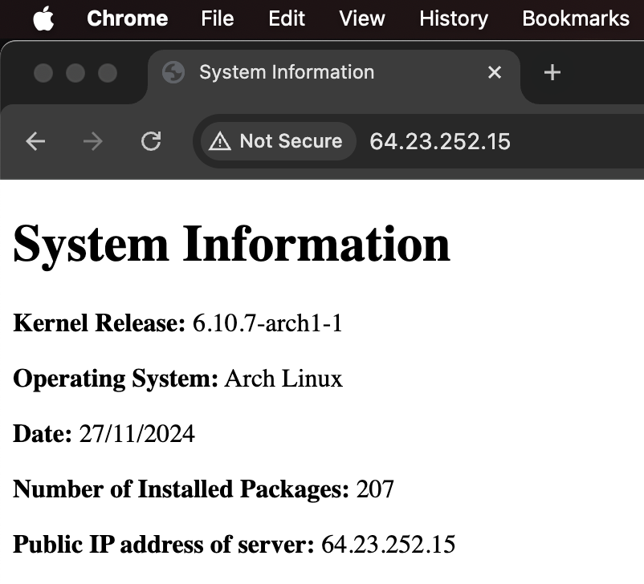

# Setting Up an Nginx Web Server on an Arch Linux Droplet

This guide will walk you through setting up an Nginx web server on an Arch Linux droplet. It's designed to be easy to follow, step by step.

### 1. Update your system
Keep your system packages up to date.
```bash
sudo pacman -Syu
```

### 2. Clone the repository
Download the necessary files from the repository.
```bash
git clone https://github.com/inspiritilda/2420_linux_assignment_3-1.git
```

### 3. `cd` into the cloned directory
Navigate into the project folder to access its contents.
```bash
cd 2420_linux_assignment_3-1
```

### 4. Create the `webgen` user
Create a system user for running scripts and serving files securely.
```bash
sudo useradd --system -d /var/lib/webgen -s /usr/bin/nologin -m webgen
```

### 5. Create the required directory structure
Set up directories for the script and generated HTML files.
```bash
sudo mkdir /var/lib/webgen/bin
sudo mkdir /var/lib/webgen/HTML
```

### 6. Copy the `generate-index` script
Place the script in the correct location, make it executable, and set ownership.
```bash
sudo cp bin/generate_index /var/lib/webgen/bin/
sudo chmod +x /var/lib/webgen/bin/generate-index
sudo chown webgen:webgen /var/lib/webgen/bin/generate-index
```

### 7. Copy timer and service files
Move the systemd service and timer files to their appropriate location.
```bash
sudo cp systemd/generate-index.service /etc/systemd/system/
sudo cp systemd/generate-index.timer /etc/systemd/system/
```

### 8. Reload `systemd` to register the files above
Update systemd to recognize the new service and timer files.
```bash
sudo systemctl daemon-reload
```

### 9. Copy the `nginx.conf` file
Replace the default Nginx configuration file with a customized version.
```bash
sudo cp nginx/nginx.conf /etc/nginx/nginx.conf
```

### 10. Set up Nginx server block
Prepare directories for organizing server block configurations.
```bash
sudo mkdir -p /etc/nginx/sites-available
sudo mkdir -p /etc/nginx/sites-enabled
```

### 11. Copy the `serverblock.conf` file to `sites-available`
Add the server block configuration and link it to `sites-enabled`.
```bash
sudo cp nginx/serverblock.conf /etc/nginx/sites-available/
sudo ln -s /etc/nginx/sites-available/serverblock.conf /etc/nginx/sites-enabled/serverblock.conf
```

### 12. Test and reload Nginx
Ensure the Nginx configuration is valid and apply the changes.
```bash
sudo nginx -t
sudo systemctl reload nginx
```

### 13. Enable UFW and configure Firewall rules
Start the firewall service and set rules to allow SSH and HTTP traffic securely.
```bash
sudo systemctl enable --now ufw.service
sudo ufw allow ssh
sudo ufw allow http
sudo ufw limit ssh
sudo ufw enable
```

### 14. Start and enable services
Run the generate-index service manually and enable the timer for daily automation.
```bash
sudo systemctl start generate-index.service
sudo systemctl enable --now generate-index.timer
```

### 15. Verify your setup
Verify the setup by entering your droplet's IP address in the web browser.
